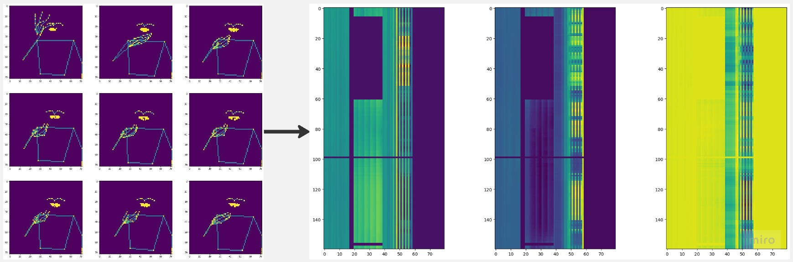
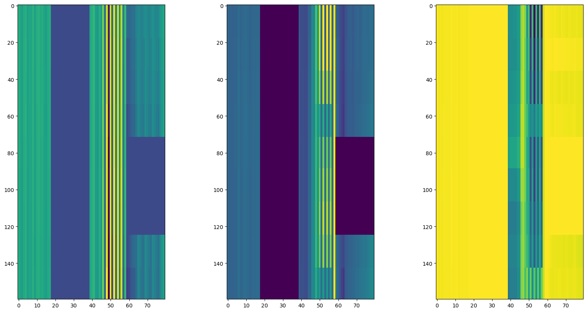
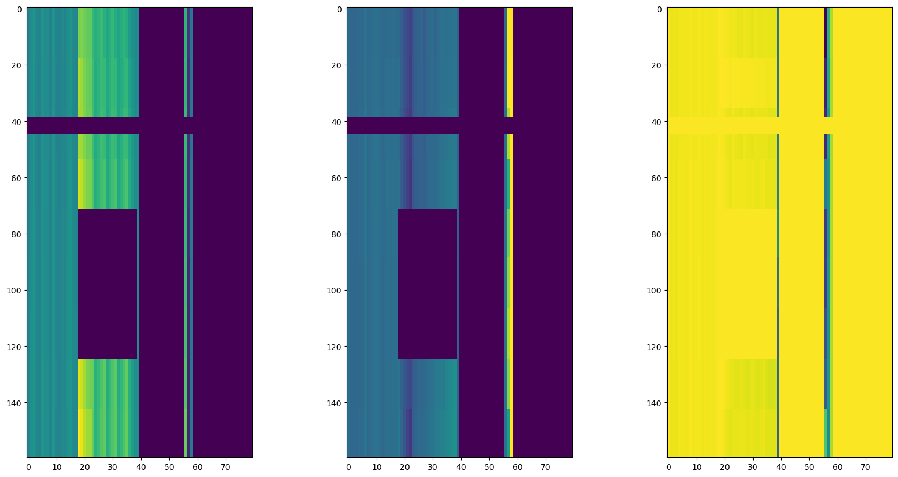

### My team's 2nd place solution in [Google - Isolated Sign Language Recognition Kaggle competition](https://www.kaggle.com/competitions/asl-signs/leaderboard)

# Solution

## TLDR
We utilized an approach similar to audio spectrogram classification using the EfficientNet-B0 model, with numerous augmentations and transformer models such as BERT and DeBERTa as helper models. The final solution consists of one EfficientNet-B0 with an input size of 160x80, trained on a single fold from 8 randomly split folds, as well as DeBERTa and BERT trained on the full dataset. A single fold model using EfficientNet has a CV score of 0.898 and a leaderboard score of ~0.8.

We used only competition data.


## 1. Data Preprocessing

### 1.1 CNN Preprocessing

* We extracted 18 lip points, 20 pose points (including arms, shoulders, eyebrows, and nose), and all hand points, resulting in a total of 80 points.
* During training, we applied various augmentations.
* We implemented standard normalization.
* Instead of dropping NaN values, we filled them with zeros after normalization.
* We interpolated the time axis to a size of 160 using 'nearest' interpolation: `yy = F.interpolate(yy[None, None, :], size=self.new_size, mode='nearest')`.
* Finally, we obtained a tensor with dimensions 160x80x3, where 3 represents the `(X, Y, Z)` axes. 

### 1.2 Transformer Preprocessing

* Only 61 points were kept, including 40 lip points and 21 hand points. For left and right hand, the one with less NaN was kept. If right hand was kept, mirror it to left hand.

* Augmentations, normalization and NaN-filling were applied sequentially.

* Sequences longer than 96 were interpolated to 96. Sequences shorter than 96 were unchanged.

* Apart from raw positions, hand-crafted features were also used, including motion, distances, and cosine of angles.

* Motion features consist of future motion and history motion, which can be denoted as:
  
$$
  Motion_{future} = position_{t+1} - position_{t}
$$
$$
  Motion_{history} = position_{t} - position_{t-1}
$$

* Full 210 pairwise distances among 21 hand points were included. 
* There are 5 vertices in a finger (e.g. thumb is `[0,1,2,3,4]`), and therefore, there are 3 angles: `<0,1,2>, <1,2,3>, <2,3,4>`. So 15 angles of 5 fingers were included.

* Randomly selected 190 pairwise distances and randomly selected 8 angles among 40 lip points were included.

## 2. Augmentation

### 2.1 Common Augmentations

> These augmentations are used in both CNN training and transformer training

1. `Random affine`: Same as @hengck23 shared. In CNN, after global affine, shift-scale-rotate was also applied to each part separately (e.g. hand, lip, body-pose).

2. `Random interpolation`: Slightly scale and shift the time dimension.

3. `Flip pose`: Flip the x-coordinates of all points. In CNN, `x_new = x_max - x_old`. In transformer, `x_new = 2 * frame[:,0,0] - x_old`.

4. `Finger tree rotate`: There are 4 root-children pairs in a finger with 5-vertices. E.g. in thumb (`[0,1,2,3,4]`), these 4 root-children pairs are: `0-[1,2,3,4]`,`1-[2,3,4]`,`2-[3,4]`,`3-[4]`. We randomly choose some of these pairs, and rotate the children points around root point with a small random angle.

### 2.2 CNN Specific Augmentations 

* `Mixup`: Implement basic mixup augmentation (only works with CNNs, not transformers).
* `Replace augmentation`: Replace some random parts from other samples of the same class.
* `Time and frequence masking`: This basic torchaudio augmentation works exceptionally well.

```python
freq_m = torchaudio.transforms.FrequencyMasking(80)  # it's time axis
time_m = torchaudio.transforms.TimeMasking(18)       # it's points axis
```

### 2.3 Augmented Sample Example

Before augmentation:

<p align="center"> </p>

After augmentation:

<p align="center">  </p>

## 3. Training

### 3.1 CNN Training

* Train on one fold with a random split (8 folds in total) or the full dataset using the best parameters
* Onecycle scheduler with 0.1 warmup.
* Use weighted `CrossEntropyLoss`. Increase the weights for poorly predicted classes and classes with semantically similar pairs (such as kitty and cat)
* Implement a hypercolumn for EfficientNet with 5 blocks


### 3.2 Transformer Training

* Train on one fold with a random split (8 folds in total) or the full dataset using the best parameters
* Ranger optimizer with 60% flat and 40% cosine annealing learning rate schedule.
* A 4-layer, 256 hidden-size, 512 intermediate-size transformer were trained.
* A 3-layer model was initialized with 4-layer model's first 3 layers. Knowledge distillation were used in 3-layer model training, in which the 4-layer model is the teacher.

### 3.3 Hyperparameter Tuning

Since we trained only one fold and used smaller models, we decided to tune most parameters with Optuna. 

Here is the parameters list of CNN training (transformer training has a similar param-list):

* All augmentations probabilities (0.1 - 0.5+)

* Learning rate (2e-3 - 3e-3)

* Drop out (0.1 - 0.25)

* Num of epochs (170-185)

* Loss weights powers (0.75 - 2)

* Optimizer (`Lookahead_RAdam`, `RAdam`)

* Label smoothing (0.5 - 0.7)

## 4. Submissions, Conversion and Ensemble

1. We rewrote all our models in Keras and transferred PyTorch weights to them, resulting in a speed boost of around 30%. For transformer model, pytorch-onnx-tf-tflite will generate too much useless tensor shape operations, a fully rewriting can reduce these manually. For CNN model, we rewrote DepthwiseConv2D with a hard-coded way, whose speed is 200%~300% of its original version of tflite DepthwiseConv2D.

2. After that, we aggregated all these models in the `tf.Module` class. Converting directly from Keras resulted in lower speed (don't know why).

3. We calculated ensemble weights for models trained on fold 0 using the local fold 0 score and applied these weights to the full dataset models.

EfficientNet-B0 achieved a leaderboard score of approximately 0.8, and transformers improved the score to 0.81. The final ensemble included:
1. Efficientnet-B0, fold 0
2. BERT, full data train
3. DeBERTa, full data train

Interestingly, a key feature was using the ensemble without softmax, which consistently provided a boost of around 0.01.

## 5. PS. Need **BETTER** TFlite DepthwiseConv2D

Depthwise convolution models performed very well for these tasks, outperforming other CNN and ViT models (rexnet_100 was also good).
We spent a lot of time dealing with the conversion of DepthwiseConv2D operation. Here are some strange results:

Given a input image with 82x42x32 (HWC), there are two ways to do a 3x3 depthwise convolution in Keras. One is `Conv2D(32, 3, groups = 32)`, the other is `DepthwiseConv2D(3)`. However, after converting these two to tflite, the running time of the `Conv2D` is 5.05ms, and the running time of `DepthwiseConv2D` is 3.70ms. More strangely, a full convolution `Conv2D(32, 3, groups = 1)` with FLOPs = HWC^2 only takes 2.09ms, even faster than previous two with FLOPs = HWC.

Then we rewrote the depthwise-conv like this:

```python
    def call(self, x):
        out = x[:,0:self.H_out:self.strides,0:self.W_out:self.strides] * self.weight[0,0]
        for i in range(self.kernel_size):
            for j in range(self.kernel_size):
                if i == 0 and j == 0:
                    continue
                out += x[:,i:self.H_out + i:self.strides,j:self.W_out + j:self.strides] * self.weight[i,j]
        if self.bias is not None:
            out = out + self.bias
        return out
```

The running time of this is 1.24 ms.

In summary, our version (1.24ms) > full `Conv2D` with larger FLOPs (2.09ms) > `DepthwiseConv2D` (3.70ms) > `Conv2D(C, groups = C)` (5.05ms).

However, our version introduced too much nodes in tflite graph, which is not stable in running time. If the tensorflow team has a better implementation of DepthwiseConv2D, we can even ensemble two CNN models, which is expected to reach 0.82 LB.

By the way, EfficientNet with ONNX was ~5 times faster than TFLite.
